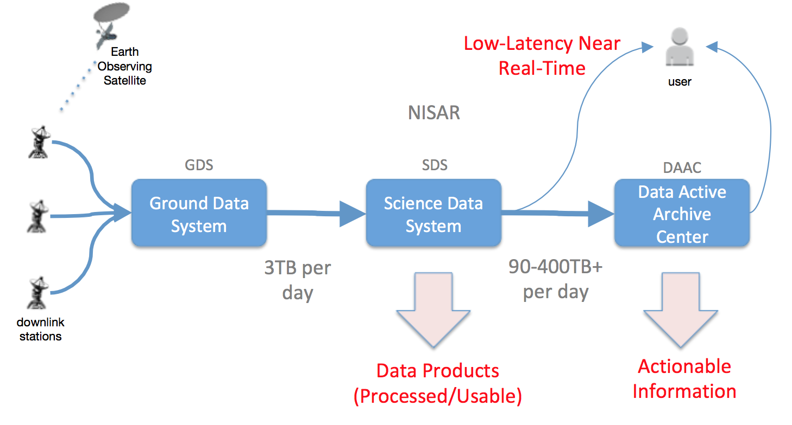
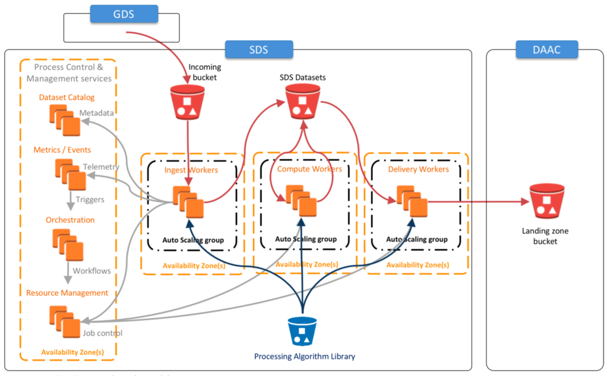
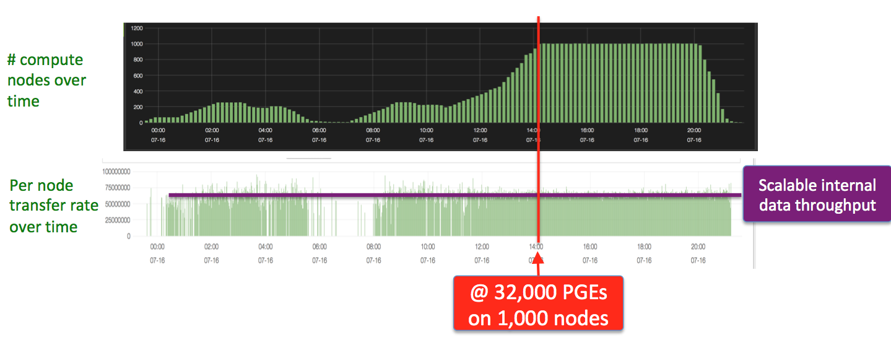
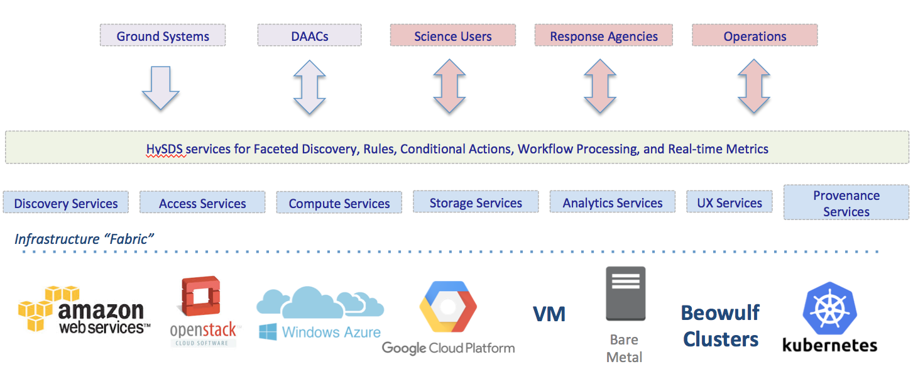
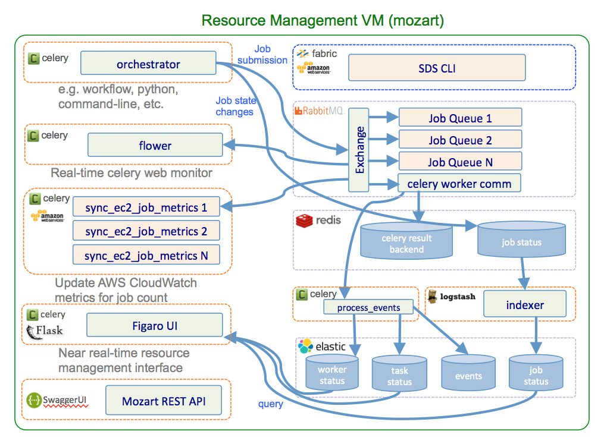
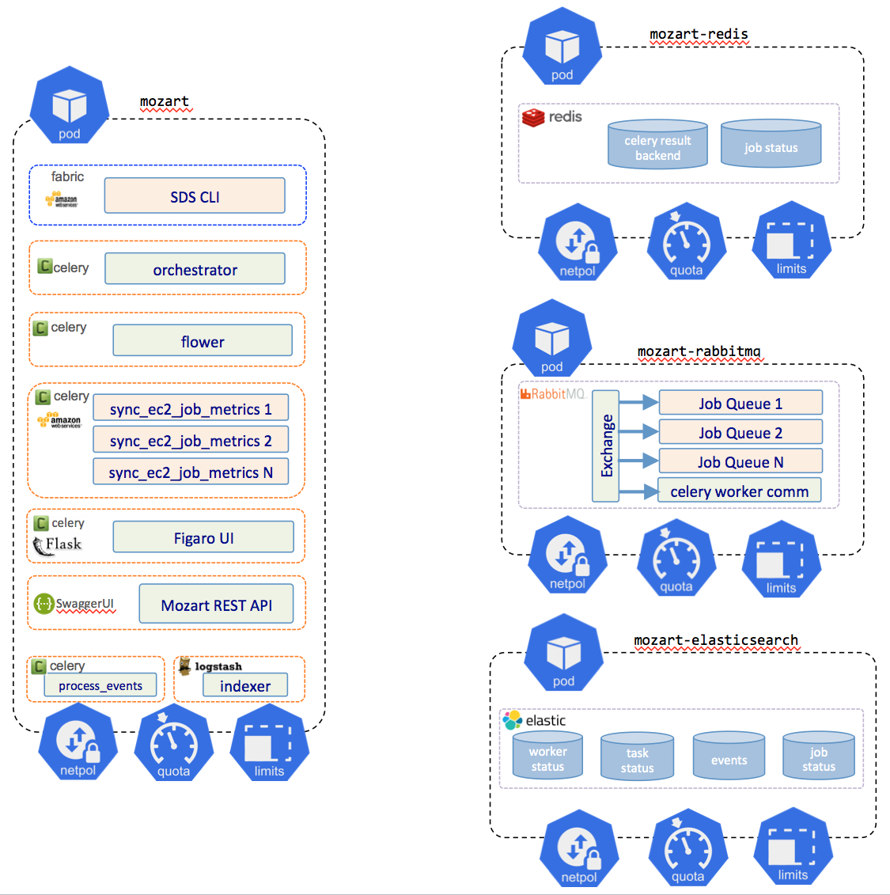
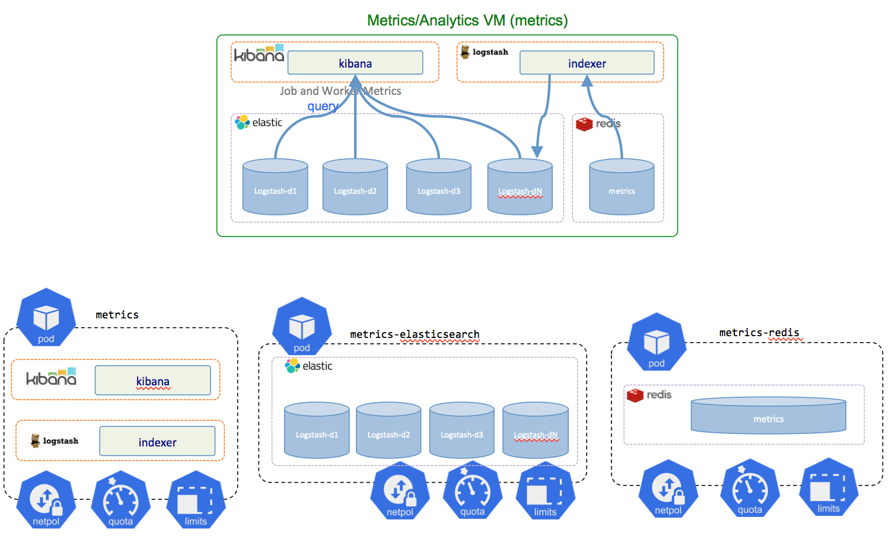
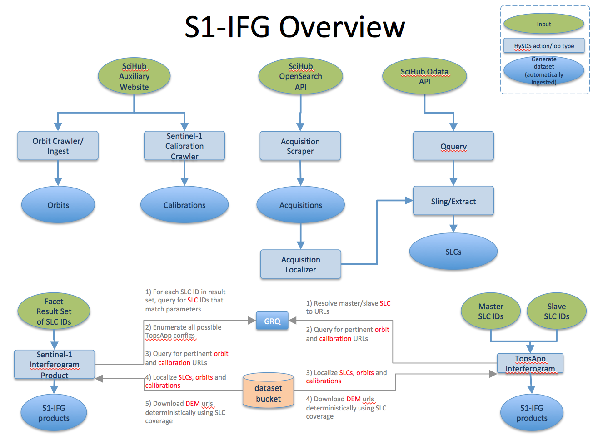

# HySDS on Kubernetes: ARIA InSAR Processing on XSEDE Jetstream :hand: fa18-516-14

| Gerald Manipon, Gregor von Laszewski, Hook Hua
| gmanipon@iu.edu, laszewski@gmail.com, hook.hua@jpl.nasa.gov
| Indiana University, Indiana University, NASA Jet Propulsion Laboratory
| hid: fa18-516-14
| github: [:cloud:](https://github.com/cloudmesh-community/fa18-516-14/blob/master/report.md)
| code: [:cloud:](https://github.com/pymonger/hysds-k8s/tree/grfn-jetstream-iu)

---

Keywords: E516, NASA, JPL, HySDS, Hybrid Cloud Science Data System, InSAR, Interferogram, Radar Interferometry, Sentinel-1, ISCE, InSAR Scientific Computing Environment, Kubernetes, OpenStack, Jetstream, Python, Terraform

---

## Abstract

Developed at NASA's Jet Propulsion Laboratory, the core of HySDS (Hybrid Cloud Science Data System) [@hysds] has been running on AWS (Amazon Web Services) and OpenStack since 2011 generating science data products for projects such as ARIA (Advanced Rapid Imaging and Analysis) [@aria], GRFN (Getting Ready for NISAR) [@grfn], and WVCC (Water Vapor Cloud Climatology) [@wvcc]. The upcoming NASA missions, SWOT (Surface Water and Ocean Topography) [@swot] and NISAR (NASA-ISRO SAR Mission) [@nisar], are slated to launch in September 2021 and January 2022, respectively, and will use HySDS in AWS as the baseline science data system. To mitigate the risk of vendor lock-in and increase the capabilities of the system, HySDS now needs to fully function on the IaaS (Infrastructure as a Service) services provided by other public and private cloud vendors such as Google Cloud Platform (GCP), Microsoft Azure, FutureSystems, Jetstream, ChameleonCloud, High Performance Computing/High End Computing and other XSEDE compute resources. Multiple funded efforts are currently in progress at JPL and EOS (Earth Observatory of Singapore) to add support for Microsoft Azure, Google Cloud Platform and the Pleiades Supercomputer however there is currently no plan to add support for NSF-funded research-based cloud resources such as those provided by XSEDE: Jetstream, ChameleonCloud and FutureSystems. In addition, HySDS was originally developed to operate at the IaaS layer however by adapting HySDS to run on Kubernetes, a container orchestration framework open-sourced by Google, portability to other cloud vendors can be vastly improved and simplified. HySDS can leverage Kubernetes as a PaaS (Platform as a Service) service that provides an abstraction layer to the vendor-specific IaaS services. In this project for the Fall 2018 E516 course at Indiana University at Bloomington, we pathfind a potential avenue for utilizing the NSF-funded XSEDE cloud resources by prototyping a real-life science use case: ARIA InSAR processing of Sentinel-1 SLC data running on HySDS on a Kubernetes cluster on IU's Jetstream Cloud. We found that by generalizing the way HySDS handles product generation executables (PGEs) and their inputs, HySDS can successfully leverage the IaaS abstraction provided by Kubernetes and can thus be provisioned onto any private or public cloud vendor capable of running Kubernetes. Further work however is needed to assess the additional overhead and complexity that Kubernetes adds to the end-to-end science data system as well as how well such a system performs and scales in a production environment.

## Background

HySDS was originally developed as the framework used to create the science data system (SDS) that *"scalably powers the ingestion, metadata extraction, cataloging, high-volume data processing, and publication of the geodetic data products for the Advanced Rapid Imaging & Analysis (ARIA), Getting Ready for NISAR (GRFN), and Water Vapor Cloud Climatology (WVCC) projects at JPL"* [@hysds]. The role of the SDS is to process the raw level0 (L0) data downloaded by the ground data system (GDS) from the satellites to higher-order level1 (L1), level2 (L2) and level3 (L3) products which are more usable to end-users. The SDS then delivers these products to a distributed active archive center (DAAC) for the purpose of providing public distribution, access, and discovery of these products. +@fig:large-data-flow depicts the role of the SDS in the end-to-end system for the upcoming NISAR mission.

{#fig:large-data-flow}

### Architecture

The SDS itself is comprised of various components to orchestrate and facilitate the processing of the raw L0 satellite data. +@fig:sds-functional-architecture depicts the functional architecture of the SDS in the context of running in AWS.

{#fig:sds-functional-architecture}

The GDS system will stage L0 data to the incoming bucket of the HySDS cluster. When an L0 dataset file is deposited, an event trigger submits an ingestion job to the resource manager which is then pulled by an autoscaling group of workers specifically provisioned for the purpose of dataset/product ingestion. During the ingestion job, the L0 data file is verified, metadata is extracted and browse images are generated. They are then copied to the SDS dataset bucket and the metadata/location of the L0 dataset is indexed into the dataset catalog. Upon indexing of the dataset into the catalog, trigger rules are evaluated and if their conditions are met, further downstream processing jobs are submitted to the resource manager. For example, the use-case we will be prototyping is the ARIA InSAR processing of Sentinel-1 SLCs into L2 interferograms. In the ARIA SDS, ingestion of an SLC triggers the Sentinel-1 interferogram workflow. This workflow, which runs on a different autoscaling group, determines if all the conditions have been met (e.g. pertinent ancillary orbit files, calibration files, digital elevation models exist) for processing an interferogram job. If so, it proceeds to generate the interferogram dataset which in turn gets ingested into the dataset bucket and indexed into the dataset catalog. Finally, the ingestion of these higher-order products trigger an evaluation of a delivery rule which runs on yet a different autoscaling group to deliver the interferogram to the DAAC's bucket or to notify them that it can be picked up from the SDS's dataset bucket.

### Processing Algorithm Library

Note also in +@fig:sds-functional-architecture that HySDS provides a processing algorithm library which serves as the catalog of all PGEs (product generation executors) that can be used by the worker fleet. Processing algorithms are usually developed by subject matter experts (e.g. radar scientists) and integrated into HySDS by installing them in container images (Docker, Singularity, rkt) along with interface documents needed by the rest of the system to submit and run jobs. The Processing Algorithm Library serves as the "App Store" for all scientific data processing that would be run on a particular HySDS cluster and provides a mechanism to import or export these PGEs for exchange.

### Pedigree

The SDS architecture detailed in +@fig:sds-functional-architecture is *NOT* novel and is very much aligned with the architectural design patterns of most other cloud data processing systems out there (e.g. AWS Batch, GCP Dataflow, Azure Batch). In fact, other data processing systems take a more cloud-native, all-in approach to their implementation. The goal of HySDS from day-one was to be as *vendor-neutral* and *cross-cloud interoperable* as possible all the while taking advantage of any performance gains by utilizing vendor-specific cloud-native features. The value-added that HySDS provides is the experience, pedigree and lessons-learned from operating science data systems at high scale since 2011. One such example is the suite of HySDS watchdogs built into the system. These watchdog subcomponents of the resource manager are dispatched to monitor and mitigate any potential issues. For example, take an SDS that has 100 jobs submitted to the resource manager. There are 5 compute workers running and executing jobs. If one of those workers had an issue, for example the root disk volume was mounted as read-only on boot-up, the job immediately fails. The compute worker then pulls the next job but that too immediately fails. Within seconds, the rogue compute worker has drained the job queue resulting in what is known as “job drain”. A highly-resilient data processing system would employ a job drain watchdog to detect this situation, determine that the rogue compute worker was not healthy, and shut down that worker immediately before more damage can be done.

Many of these lessons-learned have come from employing HySDS on forward processing and bulk reprocessing campaigns for various NASA missions and projects. For example, during a Pleiades maintenance downtime in 2015, the OCO-2 mission [@oco2] needed to run some major bulk reprocessing but did not have enough resources on-premise to provide the results in time. They utilized HySDS on AWS to process 6 million soundings (1.6 TB output) in under a day by scaling out to 1000 compute workers. +@fig:oco2-autoscaling depicts the number EC2 instances running OCO-2 sounding PGEs over time.

{#fig:oco2-autoscaling}

## Requirements

In this project, we propose to extend the capabilities of the open-source HySDS core components to support running on a Kubernetes cluster provisioned on Indiana University’s Jetstream Cloud, a compute resource provided through the XSEDE (Extreme Science and Engineering Discovery Environment) program. This requires that the HySDS system must be adapted to run process and control management nodes (PCM) and compute workers on a Kubernetes cluster. We will also adapt the ingestion, processing, and cataloguing of products generated through a scientific data pipeline running on the HySDS cluster to utilize cloud-specific but highly scalable features of the XSEDE resources. Once the HySDS Core system is completely functional on Kubernetes, research and flight mission adaptations can then be integrated and applied to provide real-world production use-cases. One such adaption is the ARIA SAR interferogram generation pipeline. The adapted HySDS/Kubernetes/Jetstream system would utilize JPL's ingested synthetic-aperture radar data, orbits, calibrations, and DEMs in order to run this pipeline to generate L2 interferogram products. Use cases for running this pipeline on XSEDE resources such as Jetstream include forward processing of level 2 SAR interferometry products as well as generating real-time urgent response products to aid in disaster response to earthquakes, hurricanes, volcanic eruptions and flooding. A sample forward-processing scenario will be conducted to assess the stability, efficiency, and capabilities of the HySDS/Kubernetes/Jetstream system. We will also compare and benchmark the execution of the ARIA interferogram pipeline on this system to the baseline performance of the ARIA HySDS system on AWS. A large number of jobs will be submitted to the system for a given amount of time. Afterwards, the results and observations will be documented to understand the system's performance.

## Design

+@fig:hysds-design-overview provides a high level overview of the various infrastructure fabric that can be used by HySDS.

{#fig:hysds-design-overview}

In this project, we are adding support for HySDS to run on Kubernetes. To do this, we need to re-architect the HySDS components to conform to the way Kubernetes does things. More specifically, we need to decompose mozart (resource management), metrics (job and worker metrics/analysis), and grq (dataset catalog) components into Kubernetes pods and services.

## Architecture

### Mozart

+@fig:mozart-vm shows the architecture of the resource management component of HySDS, mozart.

{#fig:mozart-vm}

To conform to Kubernetes best practices regarding microservices adaptation, we decided to decompose the components to the following Kubernetes pods:

{#fig:mozart-k8s}

### Metrics

Similarly, +@fig:metrics-vm-k8s shows the architecture of the metrics component of HySDS and its subsequent decomposition to Kubernetes pods:

{#fig:metrics-vm-k8s}

### GRQ

Finally, +@fig:grq-vm-k8s shows the architecture of the dataset catalog component of HySDS and its subsequent decomposition to Kubernetes pods:

{#fig:grq-vm-k8s}

### hysds-k8s

The decomposition of the HySDS components to microservice pods was implemented in a new github repository located at https://github.com/pymonger/hysds-k8s on the "grfn-jetstream-iu" branch: https://github.com/pymonger/hysds-k8s/tree/grfn-jetstream-iu. To verify and validate the operation of the HySDS cluster running on Kubernetes, we exercised the "Hello World" and "Hello Dataset" tutorials located at https://github.com/hysds/hysds-framework/wiki/Hello-World and https://github.com/hysds/hysds-framework/wiki/Hello-Dataset, respectively.

## Dataset

As stated before, once we've adapted HySDS to run on Kubernetes, we will run a real-world use case on the HySDS cluster: the ARIA Sentinel-1 interferogram pipeline. +@fig:s1-ifg-overview gives an overview of the various pipelines that ingest input datasets needed by the Sentinel-1 interferogram pipeline. 

{#fig:s1-ifg-overview}

The Sentinel-1 interferogram pipeline wraps the actual PGE (product generation executor): ISCE (InSAR Scientific Computing Environment). ISCE is open source and available for download at https://winsar.unavco.org/software/isce. To process an interferogram, the ISCE PGE needs the following inputs:

- Sentinel-1 SLCs (single look complex)
- Sentinel-1 precise orbits
- Sentinel-1 calibrations
- USGS DEMs (digital elevation models)

### Sentinel-1 SLCs

The ESA data product description describes the SLC dataset as follows:

*"Level-1 Single Look Complex (SLC) products consist of focused SAR data geo-referenced using orbit and attitude data from the satellite and provided in zero-Doppler slant-range geometry. The products include a single look in each dimension using the full transmit signal bandwidth and consist of complex samples preserving the phase information."* [@sentinel-slc]

The main source for this dataset is the SciHub portal at https://scihub.copernicus.eu/. ESA provides a rest API to query and download the SLCs as described at https://scihub.copernicus.eu/twiki/do/view/SciHubWebPortal/APIHubDescription.

### Sentinel-1 Orbits and Calibrations

In order to process the Sentinel-1 SLC dataset into an interferogram, the ISCE PGE needs multiple ancillary files pertaining to the satellite acquisition date of each SLC. It needs the precise orbit files (https://qc.sentinel1.eo.esa.int/aux_poeorb/) and it needs the auxilliary calibration files (https://qc.sentinel1.eo.esa.int/aux_cal/).

### DEMs

Finally, the ISCE PGE requires the DEM (digital elevation model) for the area covered by the SLC scene to process the interferogram. According to the USGS:

*"Digital Elevation Models (DEMs) consist of a raster grid of regularly spaced elevation values that have been primarily derived from the USGS topographic map series."* [@usgs-dem]

The DEMs are made available at the following website: https://e4ftl01.cr.usgs.gov/MEASURES/SRTMGL1.003/2000.02.11/.

## Implementation

## Benchmark

## Conclusion

## Acknowledgement

"We thank [consultant name(s)] for [his/her/their] assistance with [describe tasks such as porting, optimization, visualization, etc.], which was made possible through the XSEDE Extended Collaborative Support Service (ECSS) program."