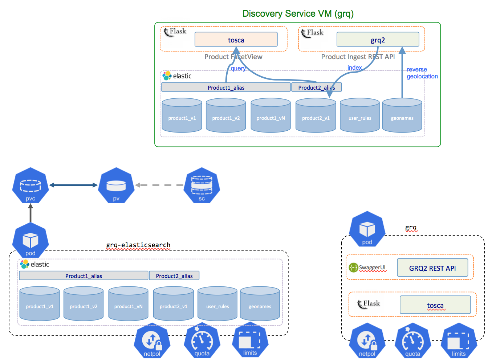
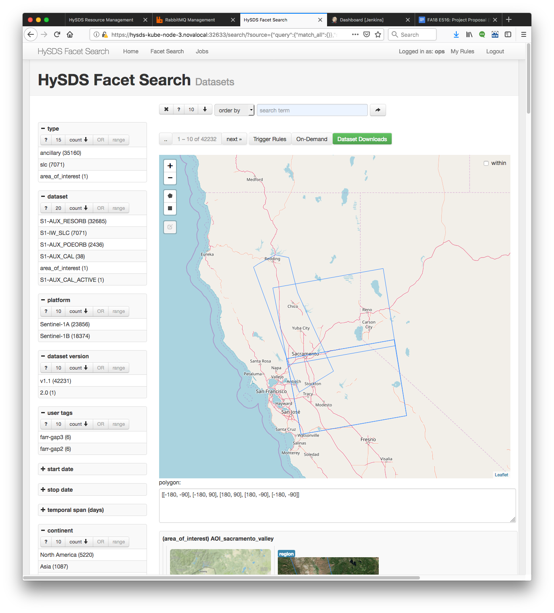

# HySDS on Kubernetes: ARIA InSAR Processing on XSEDE Jetstream :hand: fa18-516-14

| Gerald Manipon, Gregor von Laszewski, Hook Hua
| gmanipon@iu.edu, laszewski@gmail.com, hook.hua@jpl.nasa.gov
| Indiana University, Indiana University, NASA Jet Propulsion Laboratory
| hid: fa18-516-14
| github: [:cloud:](https://github.com/cloudmesh-community/fa18-516-14/blob/master/report.md)
| code: [:cloud:](https://github.com/pymonger/hysds-k8s/tree/grfn-jetstream-iu)

---

Keywords: E516, NASA, JPL, HySDS, Hybrid Cloud Science Data System, InSAR, Interferogram, Radar Interferometry, Sentinel-1, ISCE, InSAR Scientific Computing Environment, Kubernetes, OpenStack, Jetstream, Python, Terraform

---

## Abstract

Developed at NASA's Jet Propulsion Laboratory, the core of HySDS (Hybrid Cloud Science Data System) [@hysds] has been running on AWS (Amazon Web Services) and OpenStack since 2011 generating science data products for projects such as ARIA (Advanced Rapid Imaging and Analysis) [@aria], GRFN (Getting Ready for NISAR) [@grfn], and WVCC (Water Vapor Cloud Climatology) [@wvcc]. The upcoming NASA missions, SWOT (Surface Water and Ocean Topography) [@swot] and NISAR (NASA-ISRO SAR Mission) [@nisar], are slated to launch in September 2021 and January 2022, respectively, and will use HySDS in AWS as the baseline science data system. To mitigate the risk of vendor lock-in and increase the capabilities of the system, HySDS now needs to fully function on the IaaS (Infrastructure as a Service) services provided by other public and private cloud vendors such as Google Cloud Platform (GCP), Microsoft Azure, FutureSystems, Jetstream, ChameleonCloud, High Performance Computing/High End Computing and other XSEDE compute resources. Multiple funded efforts are currently in progress at JPL and EOS (Earth Observatory of Singapore) to add support for Microsoft Azure, Google Cloud Platform and the Pleiades Supercomputer however there is currently no plan to add support for NSF-funded research-based cloud resources such as those provided by XSEDE: Jetstream, ChameleonCloud and FutureSystems. In addition, HySDS was originally developed to operate at the IaaS layer however by adapting HySDS to run on Kubernetes, a container orchestration framework open-sourced by Google, portability to other cloud vendors can be vastly improved and simplified. HySDS can leverage Kubernetes as a PaaS (Platform as a Service) service that provides an abstraction layer to the vendor-specific IaaS services. In this project for the Fall 2018 E516 course at Indiana University at Bloomington, we pathfind a potential avenue for utilizing the NSF-funded XSEDE cloud resources by prototyping a real-life science use case: ARIA InSAR processing of Sentinel-1 SLC data running on HySDS on a Kubernetes cluster on IU's Jetstream Cloud. We found that by generalizing the way HySDS handles product generation executables (PGEs) and their inputs, HySDS can successfully leverage the IaaS abstraction provided by Kubernetes and can thus be provisioned onto any private or public cloud vendor capable of running Kubernetes. Further work however is needed to assess the additional overhead and complexity that Kubernetes adds to the end-to-end science data system as well as how well such a system performs and scales in a production environment.

## Background

HySDS was originally developed as the framework used to create the science data system (SDS) that *"scalably powers the ingestion, metadata extraction, cataloging, high-volume data processing, and publication of the geodetic data products for the Advanced Rapid Imaging & Analysis (ARIA), Getting Ready for NISAR (GRFN), and Water Vapor Cloud Climatology (WVCC) projects at JPL"* [@hysds]. The role of the SDS is to process the raw level0 (L0) data downloaded by the ground data system (GDS) from the satellites to higher-order level1 (L1), level2 (L2) and level3 (L3) products which are more usable to end-users. The SDS then delivers these products to a distributed active archive center (DAAC) for the purpose of providing public distribution, access, and discovery of these products. +@fig:large-data-flow depicts the role of the SDS in the end-to-end system for the upcoming NISAR mission.

{#fig:large-data-flow}

### Architecture

The SDS itself is comprised of various components to orchestrate and facilitate the processing of the raw L0 satellite data. +@fig:sds-functional-architecture depicts the functional architecture of the SDS in the context of running in AWS.

{#fig:sds-functional-architecture}

The GDS system will stage L0 data to the incoming bucket of the HySDS cluster. When an L0 dataset file is deposited, an event trigger submits an ingestion job to the resource manager which is then pulled by an autoscaling group of workers specifically provisioned for the purpose of dataset/product ingestion. During the ingestion job, the L0 data file is verified, metadata is extracted and browse images are generated. They are then copied to the SDS dataset bucket and the metadata/location of the L0 dataset is indexed into the dataset catalog. Upon indexing of the dataset into the catalog, trigger rules are evaluated and if their conditions are met, further downstream processing jobs are submitted to the resource manager. For example, the use-case we will be prototyping is the ARIA InSAR processing of Sentinel-1 SLCs into L2 interferograms. In the ARIA SDS, ingestion of an SLC triggers the Sentinel-1 interferogram workflow. This workflow, which runs on a different autoscaling group, determines if all the conditions have been met (e.g. pertinent ancillary orbit files, calibration files, digital elevation models exist) for processing an interferogram job. If so, it proceeds to generate the interferogram dataset which in turn gets ingested into the dataset bucket and indexed into the dataset catalog. Finally, the ingestion of these higher-order products trigger an evaluation of a delivery rule which runs on yet a different autoscaling group to deliver the interferogram to the DAAC's bucket or to notify them that it can be picked up from the SDS's dataset bucket.

### Processing Algorithm Library

Note also in +@fig:sds-functional-architecture that HySDS provides a processing algorithm library which serves as the catalog of all PGEs (product generation executors) that can be used by the worker fleet. Processing algorithms are usually developed by subject matter experts (e.g. radar scientists) and integrated into HySDS by installing them in container images (Docker, Singularity, rkt) along with interface documents needed by the rest of the system to submit and run jobs. The Processing Algorithm Library serves as the "App Store" for all scientific data processing that would be run on a particular HySDS cluster and provides a mechanism to import or export these PGEs for exchange.

### Pedigree

The SDS architecture detailed in +@fig:sds-functional-architecture is *NOT* novel and is very much aligned with the architectural design patterns of most other cloud data processing systems out there (e.g. AWS Batch, GCP Dataflow, Azure Batch). In fact, other data processing systems take a more cloud-native, all-in approach to their implementation. The goal of HySDS from day-one was to be as *vendor-neutral* and *cross-cloud interoperable* as possible all the while taking advantage of any performance gains by utilizing vendor-specific cloud-native features. The value-added that HySDS provides is the experience, pedigree and lessons-learned from operating science data systems at high scale since 2011. One such example is the suite of HySDS watchdogs built into the system. These watchdog subcomponents of the resource manager are dispatched to monitor and mitigate any potential issues. For example, take an SDS that has 100 jobs submitted to the resource manager. There are 5 compute workers running and executing jobs. If one of those workers had an issue, for example the root disk volume was mounted as read-only on boot-up, the job immediately fails. The compute worker then pulls the next job but that too immediately fails. Within seconds, the rogue compute worker has drained the job queue resulting in what is known as “job drain”. A highly-resilient data processing system would employ a job drain watchdog to detect this situation, determine that the rogue compute worker was not healthy, and shut down that worker immediately before more damage can be done.

Many of these lessons-learned have come from employing HySDS on forward processing and bulk reprocessing campaigns for various NASA missions and projects. For example, during a Pleiades maintenance downtime in 2015, the OCO-2 mission [@oco2] needed to run some major bulk reprocessing but did not have enough resources on-premise to provide the results in time. They utilized HySDS on AWS to process 6 million soundings (1.6 TB output) in under a day by scaling out to 1000 compute workers. +@fig:oco2-autoscaling depicts the number EC2 instances running OCO-2 sounding PGEs over time.

{#fig:oco2-autoscaling}

## Requirements

In this project, we propose to extend the capabilities of the open-source HySDS core components to support running on a Kubernetes cluster provisioned on Indiana University’s Jetstream Cloud, a compute resource provided through the XSEDE (Extreme Science and Engineering Discovery Environment) program. This requires that the HySDS system must be adapted to run process and control management nodes (PCM) and compute workers on a Kubernetes cluster. We will also adapt the ingestion, processing, and cataloguing of products generated through a scientific data pipeline running on the HySDS cluster to utilize cloud-specific but highly scalable features of the XSEDE resources. Once the HySDS Core system is completely functional on Kubernetes, research and flight mission adaptations can then be integrated and applied to provide real-world production use-cases. One such adaption is the ARIA SAR interferogram generation pipeline. The adapted HySDS/Kubernetes/Jetstream system would utilize JPL's ingested synthetic-aperture radar data, orbits, calibrations, and DEMs in order to run this pipeline to generate L2 interferogram products. Use cases for running this pipeline on XSEDE resources such as Jetstream include forward processing of level 2 SAR interferometry products as well as generating real-time urgent response products to aid in disaster response to earthquakes, hurricanes, volcanic eruptions and flooding. A sample forward-processing scenario will be conducted to assess the stability, efficiency, and capabilities of the HySDS/Kubernetes/Jetstream system. We will also compare and benchmark the execution of the ARIA interferogram pipeline on this system to the baseline performance of the ARIA HySDS system on AWS. A large number of jobs will be submitted to the system for a given amount of time. Afterwards, the results and observations will be documented to understand the system's performance.

## Design

+@fig:hysds-design-overview provides a high level overview of the various infrastructure fabric that can be used by HySDS.

{#fig:hysds-design-overview}

In this project, we are adding support for HySDS to run on Kubernetes. To do this, we need to re-architect the HySDS components to conform to the way Kubernetes does things. More specifically, we need to decompose mozart (resource management), metrics (job and worker metrics/analysis), and grq (dataset catalog) components into Kubernetes pods and services.

## Architecture

### Mozart

+@fig:mozart-vm shows the architecture of the resource management component of HySDS, mozart.

{#fig:mozart-vm}

To conform to Kubernetes best practices regarding microservices adaptation, we decided to decompose the components to the following Kubernetes pods:

{#fig:mozart-k8s}

### Metrics

Similarly, +@fig:metrics-vm-k8s shows the architecture of the metrics component of HySDS and its subsequent decomposition to Kubernetes pods:

{#fig:metrics-vm-k8s}

### GRQ

Finally, +@fig:grq-vm-k8s shows the architecture of the dataset catalog component of HySDS and its subsequent decomposition to Kubernetes pods:

{#fig:grq-vm-k8s}

### hysds-k8s

The decomposition of the HySDS components to microservice pods was implemented in a new github repository located at https://github.com/pymonger/hysds-k8s on the "grfn-jetstream-iu" branch: https://github.com/pymonger/hysds-k8s/tree/grfn-jetstream-iu. To verify and validate the operation of the HySDS cluster running on Kubernetes, we exercised the "Hello World" and "Hello Dataset" tutorials located at https://github.com/hysds/hysds-framework/wiki/Hello-World and https://github.com/hysds/hysds-framework/wiki/Hello-Dataset, respectively.

## Dataset

As stated before, once we've adapted HySDS to run on Kubernetes, we will run a real-world use case on the HySDS cluster: the ARIA Sentinel-1 interferogram pipeline. +@fig:s1-ifg-overview gives an overview of the various pipelines that ingest input datasets needed by the Sentinel-1 interferogram pipeline. 

{#fig:s1-ifg-overview}

The Sentinel-1 interferogram pipeline wraps the actual PGE (product generation executor): ISCE (InSAR Scientific Computing Environment). ISCE is open source and available for download at https://winsar.unavco.org/software/isce. To process an interferogram, the ISCE PGE needs the following inputs:

- Sentinel-1 SLCs (single look complex)
- Sentinel-1 precise orbits
- Sentinel-1 calibrations
- USGS DEMs (digital elevation models)

### Sentinel-1 SLCs

The ESA data product description describes the SLC dataset as follows:

*"Level-1 Single Look Complex (SLC) products consist of focused SAR data geo-referenced using orbit and attitude data from the satellite and provided in zero-Doppler slant-range geometry. The products include a single look in each dimension using the full transmit signal bandwidth and consist of complex samples preserving the phase information."* [@sentinel-slc]

The main source for this dataset is the SciHub portal at https://scihub.copernicus.eu/. ESA provides a rest API to query and download the SLCs as described at https://scihub.copernicus.eu/twiki/do/view/SciHubWebPortal/APIHubDescription.

### Sentinel-1 Orbits and Calibrations

In order to process the Sentinel-1 SLC dataset into an interferogram, the ISCE PGE needs multiple ancillary files pertaining to the satellite acquisition date of each SLC. It needs the precise orbit files (https://qc.sentinel1.eo.esa.int/aux_poeorb/) and it needs the auxilliary calibration files (https://qc.sentinel1.eo.esa.int/aux_cal/).

### DEMs

Finally, the ISCE PGE requires the DEM (digital elevation model) for the area covered by the SLC scene to process the interferogram. According to the USGS:

*"Digital Elevation Models (DEMs) consist of a raster grid of regularly spaced elevation values that have been primarily derived from the USGS topographic map series."* [@usgs-dem]

The DEMs are made available at the following website: https://e4ftl01.cr.usgs.gov/MEASURES/SRTMGL1.003/2000.02.11/.

## Implementation

### Create a Kubernetes Cluster on IU Jetstream

The first order of business after we have access to the IU Jetstream OpenStack cluster is to stand up a Kubernetes cluster.

1. Provision Base CentOS7 VMs for a master and 5 worker nodes according to https://iujetstream.atlassian.net/wiki/spaces/JWT/pages/44826638/Setup+for+Horizon+API+User+Instances:


2. Log into kube-master via ssh and sudo to root.
3. Elasticsearch requires the following kernel tuning parameter in `/etc/sysctl.conf`:
```
vm.max_map_count=262144
```
Ensure this is configured on each node you bring up (master + worker nodes).
To set this on a live system without having to reboot:
```
sudo sysctl -w vm.max_map_count=262144
```
4. Configure kubernetes yum repo: 
```
cat <<EOF > /etc/yum.repos.d/kubernetes.repo
[kubernetes]
name=Kubernetes
baseurl=https://packages.cloud.google.com/yum/repos/kubernetes-el7-x86_64
enabled=1
gpgcheck=1
repo_gpgcheck=1
gpgkey=https://packages.cloud.google.com/yum/doc/yum-key.gpg https://packages.cloud.google.com/yum/doc/rpm-package-key.gpg
exclude=kube*
EOF
```
5. Disable SELinux:
```
setenforce 0
```
6. Update and install kubernetes:
```
yum update -y
yum install -y kubelet kubeadm kubectl --disableexcludes=kubernetes
```
7. Start up kubelet service via systemd:
```
systemctl enable kubelet && systemctl start kubelet
```
8. Initialize your master:
```
kubeadm init
```
```
kubeadm init
[init] using Kubernetes version: v1.12.1
[preflight] running pre-flight checks
[preflight/images] Pulling images required for setting up a Kubernetes cluster
[preflight/images] This might take a minute or two, depending on the speed of your internet connection
[preflight/images] You can also perform this action in beforehand using 'kubeadm config images pull'
[kubelet] Writing kubelet environment file with flags to file "/var/lib/kubelet/kubeadm-flags.env"
[kubelet] Writing kubelet configuration to file "/var/lib/kubelet/config.yaml"
[preflight] Activating the kubelet service
[certificates] Generated ca certificate and key.
[certificates] Generated apiserver certificate and key.
[certificates] apiserver serving cert is signed for DNS names [js-156-171.jetstream-cloud.org kubernetes kubernetes.default kubernetes.default.svc kubernetes.default.svc.cluster.local] and IPs [10.96.0.1 172.28.26.7]
[certificates] Generated apiserver-kubelet-client certificate and key.
[certificates] Generated front-proxy-ca certificate and key.
[certificates] Generated front-proxy-client certificate and key.
[certificates] Generated etcd/ca certificate and key.
[certificates] Generated etcd/server certificate and key.
[certificates] etcd/server serving cert is signed for DNS names [js-156-171.jetstream-cloud.org localhost] and IPs [127.0.0.1 ::1]
[certificates] Generated etcd/peer certificate and key.
[certificates] etcd/peer serving cert is signed for DNS names [js-156-171.jetstream-cloud.org localhost] and IPs [172.28.26.7 127.0.0.1 ::1]
[certificates] Generated etcd/healthcheck-client certificate and key.
[certificates] Generated apiserver-etcd-client certificate and key.
[certificates] valid certificates and keys now exist in "/etc/kubernetes/pki"
[certificates] Generated sa key and public key.
[kubeconfig] Wrote KubeConfig file to disk: "/etc/kubernetes/admin.conf"
[kubeconfig] Wrote KubeConfig file to disk: "/etc/kubernetes/kubelet.conf"
[kubeconfig] Wrote KubeConfig file to disk: "/etc/kubernetes/controller-manager.conf"
[kubeconfig] Wrote KubeConfig file to disk: "/etc/kubernetes/scheduler.conf"
[controlplane] wrote Static Pod manifest for component kube-apiserver to "/etc/kubernetes/manifests/kube-apiserver.yaml"
[controlplane] wrote Static Pod manifest for component kube-controller-manager to "/etc/kubernetes/manifests/kube-controller-manager.yaml"
[controlplane] wrote Static Pod manifest for component kube-scheduler to "/etc/kubernetes/manifests/kube-scheduler.yaml"
[etcd] Wrote Static Pod manifest for a local etcd instance to "/etc/kubernetes/manifests/etcd.yaml"
[init] waiting for the kubelet to boot up the control plane as Static Pods from directory "/etc/kubernetes/manifests" 
[init] this might take a minute or longer if the control plane images have to be pulled
[apiclient] All control plane components are healthy after 31.502384 seconds
[uploadconfig] storing the configuration used in ConfigMap "kubeadm-config" in the "kube-system" Namespace
[kubelet] Creating a ConfigMap "kubelet-config-1.12" in namespace kube-system with the configuration for the kubelets in the cluster
[markmaster] Marking the node js-156-171.jetstream-cloud.org as master by adding the label “node-role.kubernetes.io/master=''”
[markmaster] Marking the node js-156-171.jetstream-cloud.org as master by adding the taints [node-role.kubernetes.io/master:NoSchedule]
[patchnode] Uploading the CRI Socket information “/var/run/dockershim.sock” to the Node API object “js-156-171.jetstream-cloud.org” as an annotation
[bootstraptoken] using token: r7zbx5.c5p8wc2yrwx0iikj
[bootstraptoken] configured RBAC rules to allow Node Bootstrap tokens to post CSRs in order for nodes to get long term certificate credentials
[bootstraptoken] configured RBAC rules to allow the csrapprover controller automatically approve CSRs from a Node Bootstrap Token
[bootstraptoken] configured RBAC rules to allow certificate rotation for all node client certificates in the cluster
[bootstraptoken] creating the “cluster-info” ConfigMap in the “kube-public” namespace
[addons] Applied essential addon: CoreDNS
[addons] Applied essential addon: kube-proxy

Your Kubernetes master has initialized successfully!

To start using your cluster, you need to run the following as a regular user:

  mkdir -p $HOME/.kube
  sudo cp -i /etc/kubernetes/admin.conf $HOME/.kube/config
  sudo chown $(id -u):$(id -g) $HOME/.kube/config

You should now deploy a pod network to the cluster.
Run “kubectl apply -f [podnetwork].yaml” with one of the options listed at:
  https://kubernetes.io/docs/concepts/cluster-administration/addons/

You can now join any number of machines by running the following on each node
as root:

  kubeadm join 172.28.26.7:6443 --token r7zbx5.c5p8wc2yrwx0iikj --discovery-token-ca-cert-hash sha256:e887df59ebb48a3483e55a101fe9e7ed0475182420608734725e46941817f35c
```
**Make a record of the kubeadm join command that kubeadm init outputs. You need this command to join nodes to your cluster.**

If you ever lose the join command, run this on master:
```
kubeadm token generate
kubeadm token create <generated-token> --print-join-command --ttl=0
```
8. Exit out of root back to a normal user and configure for administration:
```
exit
mkdir -p $HOME/.kube
sudo cp -i /etc/kubernetes/admin.conf $HOME/.kube/config
sudo chown $(id -u):$(id -g) $HOME/.kube/config
```
9. Deploy a pod network (Weave Net):
```
sudo sysctl net.bridge.bridge-nf-call-iptables=1
kubectl apply -f "https://cloud.weave.works/k8s/net?k8s-version=$(kubectl version | base64 | tr -d '\n')"
```
Confirm that it is working by checking that the CoreDNS pod is running in the output of `kubectl get pods --all-namespaces`. Once the CoreDNS pod is up and running, you can continue by joining your nodes:
```
kubectl get pods —all-namespaces
NAMESPACE     NAME                                                     READY   STATUS    RESTARTS   AGE
kube-system   coredns-576cbf47c7-dd68p                                 1/1     Running   0          9m35s
kube-system   coredns-576cbf47c7-m7r6t                                 1/1     Running   0          9m35s
kube-system   etcd-js-156-171.jetstream-cloud.org                      1/1     Running   0          8m52s
kube-system   kube-apiserver-js-156-171.jetstream-cloud.org            1/1     Running   0          8m33s
kube-system   kube-controller-manager-js-156-171.jetstream-cloud.org   1/1     Running   0          8m52s
kube-system   kube-proxy-vt9cn                                         1/1     Running   0          9m35s
kube-system   kube-scheduler-js-156-171.jetstream-cloud.org            1/1     Running   0          8m36s
kube-system   weave-net-wrtn6                                          2/2     Running   0          2m3s
```
9. Repeat step 2-6 above for each worker node you want to have join your cluster.
10. For each worker, ssh into it, sudo to root and run the join command output by `kubeadm init`:
```
kubeadm join --token <token> <master-ip>:<master-port> --discovery-token-ca-cert-hash sha256:<hash>
```
For example:
```
kubeadm join 172.28.26.7:6443 --token r7zbx5.c5p8wc2yrwx0iikj --discovery-token-ca-cert-hash sha256:e887df59ebb48a3483e55a101fe9e7ed0475182420608734725e46941817f35c
[preflight] running pre-flight checks
        [WARNING RequiredIPVSKernelModulesAvailable]: the IPVS proxier will not be used, because the following required kernel modules are not loaded: [ip_vs_wrr ip_vs_sh ip_vs ip_vs_rr] or no builtin kernel ipvs support: map[nf_conntrack_ipv4:{} ip_vs:{} ip_vs_rr:{} ip_vs_wrr:{} ip_vs_sh:{}]
you can solve this problem with following methods:
 1. Run ‘modprobe — ‘ to load missing kernel modules;
2. Provide the missing builtin kernel ipvs support

[discovery] Trying to connect to API Server “172.28.26.7:6443”
[discovery] Created cluster-info discovery client, requesting info from “https://172.28.26.7:6443”
[discovery] Requesting info from “https://172.28.26.7:6443” again to validate TLS against the pinned public key
[discovery] Cluster info signature and contents are valid and TLS certificate validates against pinned roots, will use API Server “172.28.26.7:6443”
[discovery] Successfully established connection with API Server “172.28.26.7:6443”
[kubelet] Downloading configuration for the kubelet from the “kubelet-config-1.12” ConfigMap in the kube-system namespace
[kubelet] Writing kubelet configuration to file “/var/lib/kubelet/config.yaml”
[kubelet] Writing kubelet environment file with flags to file “/var/lib/kubelet/kubeadm-flags.env”
[preflight] Activating the kubelet service
[tlsbootstrap] Waiting for the kubelet to perform the TLS Bootstrap…
[patchnode] Uploading the CRI Socket information “/var/run/dockershim.sock” to the Node API object “js-156-120.jetstream-cloud.org” as an annotation


This node has joined the cluster:
* Certificate signing request was sent to apiserver and a response was received.
* The Kubelet was informed of the new secure connection details.

Run 'kubectl get nodes' on the master to see this node join the cluster.
```
Verify that the worker node was registered by running `kubectl get nodes` on the master node:
```
kubectl get nodes
NAME                             STATUS   ROLES    AGE   VERSION
js-156-120.jetstream-cloud.org   Ready    <none>   41s   v1.12.1
js-156-171.jetstream-cloud.org   Ready    master   18m   v1.12.1
```

### Configuring OpenStack Cloud Provider

In order to enable the OpenStack Cloud Provider for Kubernetes, the following steps must be performed:

1. Log onto the master node and run `hostname -f` to determine it’s FQDN
2. Use the OpenStack dashboard or CLI to ensure that the instance name matches the FQDN
```
(env) centos@hysds-kube-node-1:~$ source ~/TG-CDA180009-openrc-v3.sh 
Please enter your OpenStack Password for project TG-CDA180009 as user gmanipon: 
(env) centos@hysds-kube-node-1:~$ openstack server list
+--------------------------------------+-----------------------------+--------+--------------------------------------+----------------------+-----------+
| ID                                   | Name                        | Status | Networks                             | Image                | Flavor    |
+--------------------------------------+-----------------------------+--------+--------------------------------------+----------------------+-----------+
| 53455d81-0644-4a8a-949d-e1cb1fa09622 | hysds-kube-node-3 | ACTIVE | hysds_net=10.0.0.4, 149.165.170.108  | hysds-kube-node-v1.0 | m1.medium |
| 56c94413-f1b6-4416-9ce3-688e765cb159 | hysds-kube-node-2 | ACTIVE | hysds_net=10.0.0.12, 149.165.170.183 | hysds-kube-node-v1.0 | m1.medium |
| 5f2e73e3-26fa-418d-b3d4-169f90e2d15a | hysds-kube-node-1 | ACTIVE | hysds_net=10.0.0.5, 149.165.168.35   | hysds-kube-node-v1.0 | m1.medium |
+--------------------------------------+-----------------------------+--------+--------------------------------------+----------------------+-----------+
(env) centos@hysds-kube-node-1:~$ hostname -f
hysds-kube-node-1.novalocal
```
3. In this example, the master node’s FQDN is `hysds-kube-node-1.novalocal` while the instance name in openstack is `hysds-kube-node-1`. 
4. They need to match for the in-tree OpenStack cloud provider to work so use the dashboard or the CLI to change the instance name to match the FQDN.
5. Do this for the master and all kube nodes.
#### On the master node
6. Create the cloud config file which contains the pertinent OpenStack configuration as `/etc/kubernetes/cloud.conf`. This info can be pulled from the OpenStack rc file. Note that if the `availability zone` for Nova instances and Cinder volumes are different, set the `ignore-volume-az` parameter to `true`. You can determine this by creating an openstack instance and cinder volume and comparing the `availability zone` they exist in [Cloud Providers - Kubernetes](https://kubernetes.io/docs/concepts/cluster-administration/cloud-providers/#openstack):
```
[Global]
auth-url=https://iu.jetstream-cloud.org:5000/v3
username=gmanipon
password=********
tenant-id=b16ff2e9abbb41f0b3dcb6b5ad0bd423
domain-id=decf397762654fa2945ae7d4cc49d8c2
tenant-name=TG-CDA180009
domain-name=tacc
region = RegionOne

[BlockStorage]
ignore-volume-az=true
```
7. Under `/etc/kubernetes/manifests` modify the `kube-controller-manager.yaml` and `kube-apiserver.yaml` to add the `cloud-config` and `cloud-provider` options as well as volume mounts to the `cloud.conf` you just created:
```
[...] 
spec:
  containers:
  - command:
    - kube-controller-manager (and kube-apiserver)
    - --cloud-provider=openstack
    - --cloud-config=/etc/kubernetes/cloud.conf

[...]
    volumeMounts:
    - mountPath: /etc/kubernetes/cloud.conf
      name: cloud-config
      readOnly: true 

[...]
 volumes:
  - hostPath:
      path: /etc/kubernetes/cloud.conf
      type: FileOrCreate
    name: cloud-config
[...]
```
8. Once edited, the KCM and Kube API server will automatically restart. If you receive the message "The connection to the server x was refused — did you specify the right host or port?", don’t worry, the Kube API server is restarting. It’s normal to lose the connection with it.
To confirm that these components have been configured, you can run:
```
kubectl describe pod kube-controller-manager -n kube-system | grep '/etc/kubernetes/cloud.conf'

 — cloud-config=/etc/kubernetes/cloud.conf
 /etc/kubernetes/cloud.conf from cloud-config (ro)
 Path: /etc/kubernetes/cloud.conf
```
#### On all nodes (including the master)
9. Add the `/etc/kubernetes/cloud.conf`  created on the master node to file to the same path on all nodes.
10. Edit the `/etc/systemd/system/kubelet.service.d/10-kubeadm.conf` file, adding the `—cloud-provider=openstack` and `—cloud-config=/etc/kubernetes/cloud.conf` parameters in the `KUBELET_CONFIG_ARGS` environment variable:
```
# Note: This dropin only works with kubeadm and kubelet v1.11+
[Service]
Environment="KUBELET_KUBECONFIG_ARGS=--bootstrap-kubeconfig=/etc/kubernetes/bootstrap-kubelet.conf --kubeconfig=/etc/kubernetes/kubelet.conf"
#Environment="KUBELET_CONFIG_ARGS=--config=/var/lib/kubelet/config.yaml"
Environment="KUBELET_CONFIG_ARGS=--config=/var/lib/kubelet/config.yaml --cloud-provider=openstack --cloud-config=/etc/kubernetes/cloud.conf"
# This is a file that "kubeadm init" and "kubeadm join" generates at runtime, populating the KUBELET_KUBEADM_ARGS variable dynamically
EnvironmentFile=-/var/lib/kubelet/kubeadm-flags.env
# This is a file that the user can use for overrides of the kubelet args as a last resort. Preferably, the user should use
# the .NodeRegistration.KubeletExtraArgs object in the configuration files instead. KUBELET_EXTRA_ARGS should be sourced from this file.
EnvironmentFile=-/etc/sysconfig/kubelet
ExecStart=
ExecStart=/usr/bin/kubelet $KUBELET_KUBECONFIG_ARGS $KUBELET_CONFIG_ARGS $KUBELET_KUBEADM_ARGS $KUBELET_EXTRA_ARGS
```
11. Restart kubelet service using:
```
sudo systemctl daemon-reload
sudo systemctl restart kubelet
```
12. Ensure that the node was successfully registered:
```
sudo tail -f /var/log/messages

Oct 27 15:51:32 hysds-kube-node-3 kubelet: I1027 15:51:32.470352    3320 reconciler.go:207] operationExecutor.VerifyControllerAttachedVolume started for volume "weavedb" (UniqueName: "kubernetes.io/host-path/b61b79a2-d9c2-11e8-b5d5-fa163e02ac5c-weavedb") pod "weave-net-mfdr9" (UID: "b61b79a2-d9c2-11e8-b5d5-fa163e02ac5c")
Oct 27 15:51:32 hysds-kube-node-3 kubelet: I1027 15:51:32.470366    3320 reconciler.go:154] Reconciler: start to sync state
Oct 27 15:51:32 hysds-kube-node-3 kubelet: I1027 15:51:32.898253    3320 kubelet_node_status.go:324] Adding node label from cloud provider: beta.kubernetes.io/instance-type=3
Oct 27 15:51:32 hysds-kube-node-3 kubelet: I1027 15:51:32.898300    3320 kubelet_node_status.go:335] Adding node label from cloud provider: failure-domain.beta.kubernetes.io/zone=zone-r1
Oct 27 15:51:32 hysds-kube-node-3 kubelet: I1027 15:51:32.898313    3320 kubelet_node_status.go:339] Adding node label from cloud provider: failure-domain.beta.kubernetes.io/region=RegionOne
Oct 27 15:51:32 hysds-kube-node-3 kubelet: I1027 15:51:32.901236    3320 kubelet_node_status.go:70] Attempting to register node hysds-kube-node-3.novalocal
Oct 27 15:51:33 hysds-kube-node-3 kubelet: I1027 15:51:33.227417    3320 kubelet_node_status.go:112] Node hysds-kube-node-3.novalocal was previously registered
Oct 27 15:51:33 hysds-kube-node-3 kubelet: I1027 15:51:33.458241    3320 kubelet_node_status.go:73] Successfully registered node hysds-kube-node-3.novalocal
```

You should now have a running Kubernetes cluster configured with the in-tree OpenStack Cloud Provider:

{#fig:k8s-info}

### Create HySDS Buckets (Swift Containers)

Using the OpenStack dashboard, we now need to create 2 buckets: one for the PGE docker images and one for the datasets.

{#fig:jetstream-hysds-code-bucket}

{#fig:jetstream-hysds-dataset-bucket}

### Create the HySDS cluster

Next we provision our HySDS cluster:

1. Log into kube-master via ssh.
2. Clone the `hysds-k8s` repository and checkout the `grfn-jetstream-iu` branch:
```
git clone https://github.com/pymonger/hysds-k8s
cd hysds-k8s
git checkout grfn-jetstream-iu
```
3. Run the `create_hysds_cluster.sh` script to provision all HySDS-related Kubernetes resources:
```
./create_hysds_cluster.sh
```
Note that the script requires 4 arguments:
- AWS Access Key for the ARIA datasets bucket hosted by JPL
- AWS Secret Key for the ARIA datasets bucket hosted by JPL
- Swift Access Key for the HySDS code and dataset buckets hosted on IU Jetstream
- Swift Secret Key for the HySDS code and dataset buckets hosted on IU Jetstream
4. Run the `get_urls.sh` script to list the urls for all HySDS web interfaces and REST APIs:
```
./get_urls.sh
```

### Register the lightweight-jobs and ariamh repositories in Jenkins

1. Log into kube-master via ssh.
2. Log into the mozart pod using kubectl:
```
kubectl exec -ti mozart bash
```
3. Register the lightweight-jobs repo to Jenkins:
```
sds ci add_job -k -b master https://github.com/hysds/lightweight-jobs.git s3
```
4. Register the ariamh repo to Jenkins:
```
sds ci add_job -k -b jetstream-iu-k8s https://github.com/hysds/ariamh.git s3
```
You should now see both jobs registered in Jenkins:

{#fig:jenkins-jobs}

5. Log into the Jenkins web interface and push the builds for lightweight-jobs and ariamh. You should see the jobs build to completion via the console log output:

{#fig:jenkins-build_ariamh}

### Submit Sentinel-1 Interferogram Jobs

To facilitate running the Sentinel-1 Interferogram pipeline in Kubernetes without having to ingest 1TB of input datasets, we copy the dataset indexes from the ARIA HySDS cluster at JPL. Access to these indexes requires special permissions so please contact me at gmanipon@jpl.nasa.gov for more information. Assuming the indexes have been set up on the grq component of the HySDS/Kubernetes/Jetstream cluster, you should see SLCs, precise orbits and calibration files available in the tosca interface:

{#fig:tosca-input_datasets}

We can now use the tosca interface to submit Sentinel-1 interferogram jobs.

1. In the tosca interface, draw a bounding box over an area of interest. In our case, we draw a box over the area north of Los Angeles. We then facet down to the S1-IW_SLC dataset type and track 71:

{#fig:tosca-los_angeles-t71}

2. Click on the "On-Demand" button. This will bring up a modal window that will allow you to submit jobs based on the result set that was faceted down to. Select the "Sentinel-1 Interferogram Product [jetstream-iu-k8s]" action and select the "grfn-job_worker-small" queue:

{#fig:tosca-job_submission}

The PGE-specific parameters below can be used unchanged. Click on "Process Now" to submit the job:

{#fig:tosca-job_submission2}

Alternately, the Mozart REST API is a Swagger/OpenAPI-compliant REST interface that can be used to submit jobs:

{#fig:swagger-mozart}

3. Monitor the jobs that were submitted by navigating to the figaro interface:

{#fig:figaro}

The figaro interface provides a faceted view of the HySDS cluster's resource managment. This includes job state information as well as information on tasks, workers, and events. Alternately, the RabbitMQ admin interface provides a real-time view of the job queues:

{#fig:rabbitmq}

4. When the Sentinel-1 interferogram jobs complete, they can be viewed via the tosca interface by faceting on the S1-IFG dataset type:

{#fig:tosca-ifg}

## Benchmark

After running a few Sentinel-1 inteferogram jobs, we can log into the Kibana job metrics interface on the metrics node to view the average execution time of these jobs:

{#fig:metrics-jobs}

We note that it takes an average of 45 minutes to run each job on the HySDS/Kubernetes/Jetstream cluster. In comparison, the ARIA HySDS cluster on AWS takes an average of 25 minutes to run each job. Worker nodes on the ARIA HySDS cluster utilize the c5.9xlarge EC2 instance type (36 vCPUs and 72GB RAM) vs. the worker nodes on the HySDS/Kubernetes/Jetstream cluster which utilize the m1.xlarge flavor (24 vCPUs and 60GB RAM). This discrepancy shows that the ISCE PGE performs better when it is given more vCPUs and RAM to work with.

## Conclusion

## Acknowledgement

"We thank [consultant name(s)] for [his/her/their] assistance with [describe tasks such as porting, optimization, visualization, etc.], which was made possible through the XSEDE Extended Collaborative Support Service (ECSS) program."